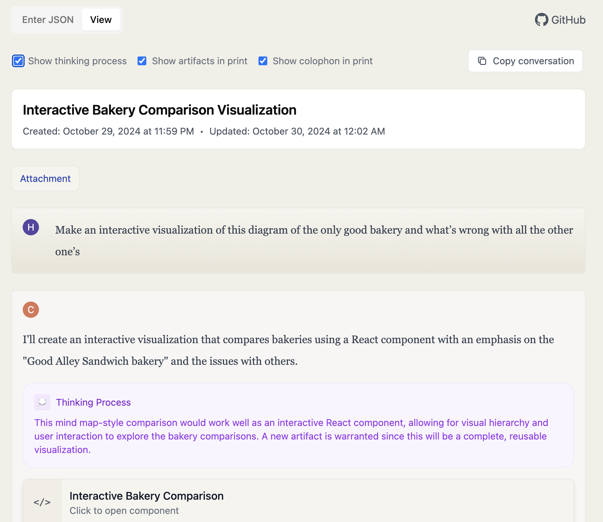

# Claude Chat Viewer

A web application for viewing Claude chat conversations from exported JSON files. Renders Claude's chat JSON exports in a clean, readable format with support for code blocks, artifacts, and thinking process sections.



## Features

- View Claude chat JSON exports in a readable format
- Direct ZIP archive upload - no extraction needed
- Browse and select from multiple conversations (conversations.json support)
- Advanced search and filtering for conversations:
  - Search by title/summary or full conversation text
  - Regular expression (regex) pattern matching
  - Case-sensitive search option
  - Real-time filtering with result counter
- Support for code blocks with syntax highlighting
- Download all code and artifacts as a zip file
- Copy entire conversations with formatting preserved
- Display Claude's thinking process (optional)
- Print-friendly layout
- Responsive design
- Persistent storage of last viewed conversation

## Usage

Visit [tools.osteele.com/claude-chat-viewer](https://tools.osteele.com/claude-chat-viewer) to use the application.

### Viewing Individual Conversations

1. Export your Claude chat as JSON
2. Click "Enter JSON" in the viewer or use the "Upload File" button
3. Paste your JSON or select a file
4. View your conversation in a clean, readable format

### Viewing Multiple Conversations

The viewer supports Claude's full data export in two ways:

#### Option 1: Direct ZIP Upload (Recommended)
1. Request a data export from Claude (Settings → Account → Request Export)
2. Download the ZIP archive when ready
3. Click "Upload File" and select the ZIP directly - no extraction needed!
4. Browse through all your conversations with summaries
5. Select any conversation to view in detail
6. Use the header navigation to switch between conversations

#### Option 2: Upload conversations.json
1. Extract the Claude export ZIP
2. Upload the `conversations.json` file using the "Upload File" button
3. Browse and select from your conversations

### Searching Conversations

When browsing multiple conversations, you can use the search feature to quickly find specific conversations:

- **Search by Title & Summary**: Quick search through conversation names and summaries
- **Search Full Text**: Deep search through all messages in conversations
- **Regex Mode**: Use regular expressions for advanced pattern matching (e.g., `\d{4}-\d{2}-\d{2}` for dates)
- **Case Sensitive**: Toggle for exact case matching
- **Clear Button**: Click the X button to quickly clear your search

### Loading Files via URL Parameter

In development mode, you can load files directly via URL parameter:

```
# Single conversation
http://localhost:5173/?file=inputs/chat.json

# Multiple conversations
http://localhost:5173/?file=inputs/data/conversations.json
```

This is particularly useful for:
- Development and testing with sample data
- Sharing specific conversation files
- Automating the viewer with pre-loaded content

### Downloading Artifacts

Click the "Download Artifacts" button to download all code snippets and artifacts as a zip file. The downloaded archive will:
- Maintain file extensions based on language or MIME type
- Preserve directory structure from file paths
- Include all code snippets and tool outputs from the conversation
- Name files based on their titles or content

### Copying Conversations

Click the "Copy conversation" button to copy the entire conversation to your clipboard. The copied text will:
- Preserve formatting when pasted into rich text editors (like Google Docs or Word)
- Include proper formatting for code blocks with monospace font
- Fall back to clean plain text when pasted into plain text editors

### Printing

Use your browser's print function to create a PDF or paper copy. The viewer automatically formats the conversation for printing.

### Keyboard Shortcuts

- `Cmd/Ctrl + V` - Paste JSON
- `Tab` - Navigate between elements
- `Enter` - Activate buttons and controls

## Local Installation

If you want to run the viewer locally:

```bash
# Clone the repository
git clone https://github.com/osteele/claude-chat-viewer.git

# Install dependencies
cd claude-chat-viewer
bun install

# Start the development server
bun dev
```

Visit http://localhost:5173 in your browser.

## Contributing

See [CONTRIBUTING.md](CONTRIBUTING.md) for development setup and guidelines.

## More Tools

Check out my [other web applications](https://osteele.com/software/web-apps/) and [AI & LLM tools](https://osteele.com/topics/ai).

## Acknowledgements

Inspired by Simon Willison's [Convert Claude JSON to
Markdown](https://observablehq.com/@simonw/convert-claude-json-to-markdown)
tool.

Written with [Claude](https://www.anthropic.com/claude) 🤖 and
[Cursor](https://www.cursor.com) ✨

Thanks to [@adamnemecek](https://github.com/adamnemecek) for the UI improvement suggestion (#1).

## License

MIT
